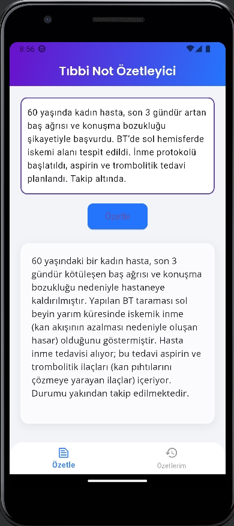
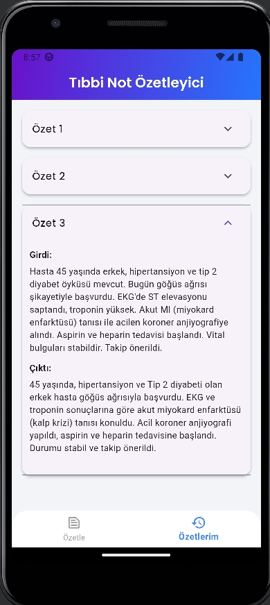

# Tıbbi Not Özetleyici 

Bu proje, doktorlar, tıp öğrencileri ve hastalar için geliştirilen yapay zeka destekli bir mobil uygulamadır. Kullanıcılar, tıbbi metinlerini uygulamaya yapıştırarak Google Gemini API kullanılarak otomatik olarak özetlenmesini sağlar. Özetlenen metinler yerel veritabanında saklanır ve uygulama yeniden açıldığında geçmiş özetler görüntülenir.

---

<div style="display: flex; justify-content: center; gap: 20px; flex-wrap: wrap;">
  
  
</div>

---

## Kullanım

- Ana ekranda tıbbi metninizi yazın veya yapıştırın.  
- **Özetle** butonuna basın.  
- Özet hemen aşağıda görünecektir.  
- Önceki özetlerinize “Özetlerim” sekmesinden ulaşabilirsiniz.

---

## Kurulum ve Çalıştırma

1. Projeyi klonlayın veya indirin:
   ```bash
   git clone https://github.com/ClosePrize/YZTA_Bootcamp_Group185.git
   cd YZTA_Bootcamp_Group185
     ```
2. Bağımlılıkları yükleyin:
   ```bash
   flutter pub get
      ```
3. .env dosyasını oluşturun projenizin kök dizininde:
   ```bash
   GEMINI_API_KEY=buraya_google_gemini_api_anahtarınızı_yapıştırın
      ```
4. Uygulamayı çalıştırın:
   ```bash
   flutter run
   ```

---

## Özellikler

- Tıbbi metin giriş alanı
- Google Gemini API ile metin özetleme
- Özet geçmişinin yerel veritabanında saklanması
- Kolay ve estetik kullanıcı arayüzü
- Özet ve geçmiş sekmeleri ile hızlı erişim

